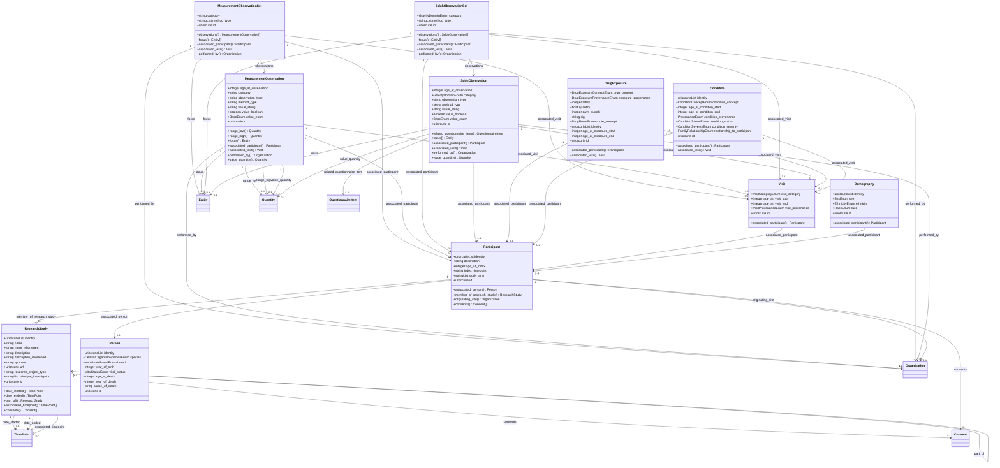

```mermaid

classDiagram
    class MeasurementObservationSet {
        +string category
        +stringList method_type
        +uriorcurie id
        +observations() MeasurementObservation[]
        +focus() Entity[]
        +associated_participant() Participant
        +associated_visit() Visit
        +performed_by() Organization
    }
    
    class MeasurementObservation {
        +integer age_at_observation
        +string category
        +string observation_type
        +string method_type
        +string value_string
        +boolean value_boolean
        +BaseEnum value_enum
        +uriorcurie id
        +range_low() Quantity
        +range_high() Quantity
        +focus() Entity
        +associated_participant() Participant
        +associated_visit() Visit
        +performed_by() Organization
        +value_quantity() Quantity
    }
    
    class SdohObservationSet {
        +GravityDomainEnum category
        +stringList method_type
        +uriorcurie id
        +observations() SdohObservation[]
        +focus() Entity[]
        +associated_participant() Participant
        +associated_visit() Visit
        +performed_by() Organization
    }
    
    class SdohObservation {
        +integer age_at_observation
        +GravityDomainEnum category
        +string observation_type
        +string method_type
        +string value_string
        +boolean value_boolean
        +BaseEnum value_enum
        +uriorcurie id
        +related_questionnaire_item() QuestionnaireItem
        +focus() Entity
        +associated_participant() Participant
        +associated_visit() Visit
        +performed_by() Organization
        +value_quantity() Quantity
    }
    
    class DrugExposure {
        +DrugExposureConceptEnum drug_concept
        +DrugExposureProvenanceEnum exposure_provenance
        +integer refills
        +float quantity
        +integer days_supply
        +string sig
        +DrugRouteEnum route_concept
        +uriorcurieList identity
        +integer age_at_exposure_start
        +integer age_at_exposure_end
        +uriorcurie id
        +associated_participant() Participant
        +associated_visit() Visit
    }
    
    class Condition {
        +uriorcurieList identity
        +ConditionConceptEnum condition_concept
        +integer age_at_condition_start
        +integer age_at_condition_end
        +ProvenanceEnum condition_provenance
        +ConditionStatusEnum condition_status
        +ConditionSeverityEnum condition_severity
        +FamilyRelationshipEnum relationship_to_participant
        +uriorcurie id
        +associated_participant() Participant
        +associated_visit() Visit
    }
    
    class Visit {
        +VisitCategoryEnum visit_category
        +integer age_at_visit_start
        +integer age_at_visit_end
        +VisitProvenanceEnum visit_provenance
        +uriorcurie id
        +associated_participant() Participant
    }
    
    class ResearchStudy {
        +uriorcurieList identity
        +string name
        +string name_shortened
        +string description
        +string description_shortened
        +string sponsor
        +uriorcurie url
        +string research_project_type
        +stringList principal_investigator
        +uriorcurie id
        +date_started() TimePoint
        +date_ended() TimePoint
        +part_of() ResearchStudy
        +associated_timepoint() TimePoint[]
        +consents() Consent[]
    }
    
    class Participant {
        +uriorcurieList identity
        +string description
        +integer age_at_index
        +string index_timepoint
        +stringList study_arm
        +uriorcurie id
        +associated_person() Person
        +member_of_research_study() ResearchStudy
        +originating_site() Organization
        +consents() Consent[]
    }
    
    class Demography {
        +uriorcurieList identity
        +SexEnum sex
        +EthnicityEnum ethnicity
        +RaceEnum race
        +uriorcurie id
        +associated_participant() Participant
    }
    
    class Person {
        +uriorcurieList identity
        +CellularOrganismSpeciesEnum species
        +VertebrateBreedEnum breed
        +integer year_of_birth
        +VitalStatusEnum vital_status
        +integer age_at_death
        +integer year_of_death
        +string cause_of_death
        +uriorcurie id
    }
    
    class Entity {
    }
    
    class Quantity {
    }
    
    class Organization {
    }
    
    class QuestionnaireItem {
    }
    
    class TimePoint {
    }
    
    class Consent {
    }
    
    MeasurementObservationSet "1" --> "*" MeasurementObservation : observations
    MeasurementObservationSet "1" --> "0..*" Entity : focus
    MeasurementObservationSet "1" --> "0..1" Participant : associated_participant
    MeasurementObservationSet "1" --> "0..1" Visit : associated_visit
    MeasurementObservationSet "1" --> "0..1" Organization : performed_by
    
    MeasurementObservation "1" --> "0..1" Quantity : range_low
    MeasurementObservation "1" --> "0..1" Quantity : range_high
    MeasurementObservation "1" --> "0..1" Entity : focus
    MeasurementObservation "1" --> "0..1" Participant : associated_participant
    MeasurementObservation "1" --> "0..1" Visit : associated_visit
    MeasurementObservation "1" --> "0..1" Organization : performed_by
    MeasurementObservation "1" --> "0..1" Quantity : value_quantity
    
    SdohObservationSet "1" --> "*" SdohObservation : observations
    SdohObservationSet "1" --> "0..*" Entity : focus
    SdohObservationSet "1" --> "0..1" Participant : associated_participant
    SdohObservationSet "1" --> "0..1" Visit : associated_visit
    SdohObservationSet "1" --> "0..1" Organization : performed_by
    
    SdohObservation "1" --> "0..1" QuestionnaireItem : related_questionnaire_item
    SdohObservation "1" --> "0..1" Entity : focus
    SdohObservation "1" --> "0..1" Participant : associated_participant
    SdohObservation "1" --> "0..1" Visit : associated_visit
    SdohObservation "1" --> "0..1" Organization : performed_by
    SdohObservation "1" --> "0..1" Quantity : value_quantity
    
    DrugExposure "1" --> "0..1" Participant : associated_participant
    DrugExposure "1" --> "0..1" Visit : associated_visit
    
    Condition "1" --> "0..1" Participant : associated_participant
    Condition "1" --> "0..1" Visit : associated_visit
    
    Visit "1" --> "0..1" Participant : associated_participant
    
    ResearchStudy "1" --> "0..1" TimePoint : date_started
    ResearchStudy "1" --> "0..1" TimePoint : date_ended
    ResearchStudy "1" --> "0..1" ResearchStudy : part_of
    ResearchStudy "1" --> "0..*" TimePoint : associated_timepoint
    ResearchStudy "1" --> "0..*" Consent : consents
    
    Participant "1" --> "0..1" Person : associated_person
    Participant "1" --> "0..1" ResearchStudy : member_of_research_study
    Participant "1" --> "0..1" Organization : originating_site
    Participant "1" --> "0..*" Consent : consents
    
    Demography "1" --> "0..1" Participant : associated_participant
```
