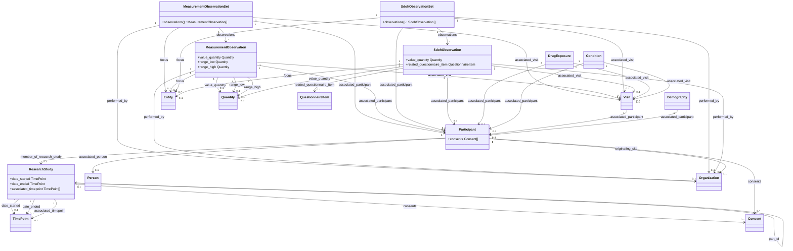

```mermaid
classDiagram
    class MeasurementObservationSet {
        +observations() MeasurementObservation[]
    }
    
    class MeasurementObservation {
        +value_quantity Quantity
        +range_low Quantity
        +range_high Quantity
    }
    
    class SdohObservationSet {
        +observations() SdohObservation[]
    }
    
    class SdohObservation {
        +value_quantity Quantity
        +related_questionnaire_item QuestionnaireItem
    }
    
    class DrugExposure {
    }
    
    class Condition {
    }
    
    class Visit {
    }
    
    class ResearchStudy {
        +date_started TimePoint
        +date_ended TimePoint
        +associated_timepoint TimePoint[]
    }
    
    class Participant {
        +consents Consent[]
    }
    
    class Demography {
    }
    
    class Person {
    }
    
    class Entity {
    }
    
    class Quantity {
    }
    
    class Organization {
    }
    
    class QuestionnaireItem {
    }
    
    class TimePoint {
    }
    
    class Consent {
    }
    
    MeasurementObservationSet "1" --> "*" MeasurementObservation : observations
    MeasurementObservationSet "1" --> "0..*" Entity : focus
    MeasurementObservationSet "1" --> "0..1" Participant : associated_participant
    MeasurementObservationSet "1" --> "0..1" Visit : associated_visit
    MeasurementObservationSet "1" --> "0..1" Organization : performed_by
    
    MeasurementObservation "1" --> "0..1" Entity : focus
    MeasurementObservation "1" --> "0..1" Participant : associated_participant
    MeasurementObservation "1" --> "0..1" Visit : associated_visit
    MeasurementObservation "1" --> "0..1" Organization : performed_by
    MeasurementObservation "1" --> "0..1" Quantity : value_quantity
    MeasurementObservation "1" --> "0..1" Quantity : range_low
    MeasurementObservation "1" --> "0..1" Quantity : range_high
    
    SdohObservationSet "1" --> "*" SdohObservation : observations
    SdohObservationSet "1" --> "0..*" Entity : focus
    SdohObservationSet "1" --> "0..1" Participant : associated_participant
    SdohObservationSet "1" --> "0..1" Visit : associated_visit
    SdohObservationSet "1" --> "0..1" Organization : performed_by
    
    SdohObservation "1" --> "0..1" QuestionnaireItem : related_questionnaire_item
    SdohObservation "1" --> "0..1" Entity : focus
    SdohObservation "1" --> "0..1" Participant : associated_participant
    SdohObservation "1" --> "0..1" Visit : associated_visit
    SdohObservation "1" --> "0..1" Organization : performed_by
    SdohObservation "1" --> "0..1" Quantity : value_quantity
    
    DrugExposure "1" --> "0..1" Participant : associated_participant
    DrugExposure "1" --> "0..1" Visit : associated_visit
    
    Condition "1" --> "0..1" Participant : associated_participant
    Condition "1" --> "0..1" Visit : associated_visit
    
    Visit "1" --> "0..1" Participant : associated_participant
    
    ResearchStudy "1" --> "0..1" TimePoint : date_started
    ResearchStudy "1" --> "0..1" TimePoint : date_ended
    ResearchStudy "1" --> "0..1" ResearchStudy : part_of
    ResearchStudy "1" --> "0..*" TimePoint : associated_timepoint
    ResearchStudy "1" --> "0..*" Consent : consents
    
    Participant "1" --> "0..1" Person : associated_person
    Participant "1" --> "0..1" ResearchStudy : member_of_research_study
    Participant "1" --> "0..1" Organization : originating_site
    Participant "1" --> "0..*" Consent : consents
    
    Demography "1" --> "0..1" Participant : associated_participant
```

