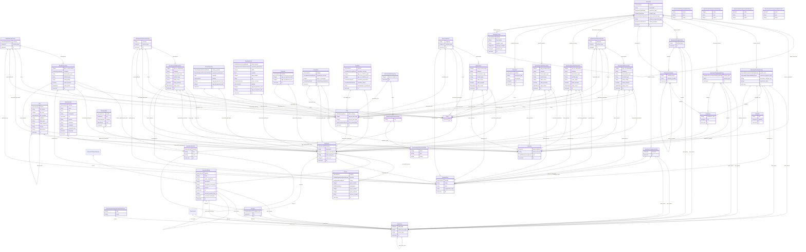

```mermaid
erDiagram
SdohObservation {
    integer age_at_observation  
    GravityDomainEnum category  
    string observation_type  
    string method_type  
    string value_string  
    boolean value_boolean  
    BaseEnum value_enum  
    uriorcurie id  
}
SdohObservationSet {
    GravityDomainEnum category  
    stringList method_type  
    uriorcurie id  
}
Entity {
    uriorcurie id  
}
MeasurementObservation {
    integer age_at_observation  
    string category  
    string observation_type  
    string method_type  
    string value_string  
    boolean value_boolean  
    BaseEnum value_enum  
    uriorcurie id  
}
MeasurementObservationSet {
    string category  
    stringList method_type  
    uriorcurie id  
}
Observation {
    integer age_at_observation  
    string category  
    string observation_type  
    string method_type  
    string value_string  
    boolean value_boolean  
    BaseEnum value_enum  
    uriorcurie id  
}
ObservationSet {
    string category  
    stringList method_type  
    uriorcurie id  
}
BodySite {
    string site  
    stringList qualifier  
    uriorcurie id  
}
Quantity {
    decimal value_decimal  
    string value_concept  
    UnitOfMeasurementEnum unit  
    uriorcurie id  
}
Substance {
    string substance_type  
    stringList role  
    uriorcurie id  
}
BiologicProduct {
    uriorcurieList identity  
    string description  
    string product_type  
    integerList passage_number  
    stringList growth_rate  
    uriorcurie id  
}
SpecimenTransportActivity {
    stringList duration  
    uriorcurie id  
}
SpecimenStorageActivity {
    string method_type  
    uriorcurie id  
}
SpecimenContainer {
    string container_type  
    string container_number  
    uriorcurie id  
}
SpecimenProcessingActivity {
    SpecimenProcessingActivityTypeEnum activity_type  
    string method_type  
    uriorcurie id  
}
SpecimenQuantityObservation {
    integer age_at_observation  
    string category  
    string observation_type  
    string method_type  
    string value_string  
    boolean value_boolean  
    BaseEnum value_enum  
    uriorcurie id  
}
SpecimenQualityObservation {
    integer age_at_observation  
    string category  
    string observation_type  
    string method_type  
    string value_string  
    boolean value_boolean  
    BaseEnum value_enum  
    uriorcurie id  
}
SpecimenCreationActivity {
    SpecimenCreationActivityTypeEnum activity_type  
    SpecimenCollectionMethodType collection_method_type  
    string derivation_method_type  
    integer specimen_order  
    uriorcurie id  
}
Specimen {
    uriorcurieList identity  
    string description  
    SpecimenTypeEnum specimen_type  
    AnalyteTypeEnum analyte_type  
    SourceMaterialTypeEnum source_material_type  
    string cellular_composition_type  
    SectionLocationEnum section_location  
    uriorcurie id  
}
Document {
    uriorcurieList identity  
    string document_type  
    string description  
    stringList url  
    uriorcurie id  
}
File {
    uriorcurieList identity  
    string file_name  
    integer file_size  
    uriorcurieList file_location  
    string md5sum  
    string data_type  
    string data_category  
    string format  
    string description  
    uriorcurie id  
}
DimensionalObservationSet {
    string category  
    stringList method_type  
    uriorcurie id  
}
DimensionalObservation {
    integer age_at_observation  
    string category  
    string observation_type  
    string method_type  
    string value_string  
    boolean value_boolean  
    BaseEnum value_enum  
    uriorcurie id  
}
DeviceExposure {
    DeviceExposureConceptEnum device_concept  
    DeviceExposureProvenanceEnum exposure_provenance  
    float quantity  
    uriorcurieList identity  
    integer age_at_exposure_start  
    integer age_at_exposure_end  
    uriorcurie id  
}
DrugExposure {
    DrugExposureConceptEnum drug_concept  
    DrugExposureProvenanceEnum exposure_provenance  
    integer refills  
    float quantity  
    integer days_supply  
    string sig  
    DrugRouteEnum route_concept  
    uriorcurieList identity  
    integer age_at_exposure_start  
    integer age_at_exposure_end  
    uriorcurie id  
}
Exposure {
    uriorcurieList identity  
    integer age_at_exposure_start  
    integer age_at_exposure_end  
    uriorcurie id  
}
Procedure {
    uriorcurieList identity  
    ProcedureConceptEnum procedure_concept  
    integer age_at_procedure  
    ProvenanceEnum procedure_provenance  
    uriorcurie id  
}
Condition {
    uriorcurieList identity  
    ConditionConceptEnum condition_concept  
    integer age_at_condition_start  
    integer age_at_condition_end  
    ProvenanceEnum condition_provenance  
    ConditionStatusEnum condition_status  
    string relationship_to_participant  
    uriorcurie id  
}
QuestionnaireResponseValueString {
    string value  
    string type  
    string name  
}
QuestionnaireResponseValueTimePoint {
    string type  
    string name  
}
QuestionnaireResponseValueInteger {
    integer value  
    string type  
    string name  
}
QuestionnaireResponseValueBoolean {
    boolean value  
    string type  
    string name  
}
QuestionnaireResponseValueDecimal {
    decimal value  
    string type  
    string name  
}
QuestionnaireResponseValue {
    string value  
    string type  
    string name  
}
QuestionnaireResponseItem {
    string text  
}
QuestionnaireResponse {
    integer age_at_response  
    uriorcurie id  
}
QuestionnaireItem {
    uriorcurieList identity  
    string text  
    string code  
    uriorcurie id  
}
Questionnaire {
    uriorcurieList identity  
    string name  
    string title  
    string description  
    uriorcurie url  
    string version  
    string publisher  
    string copyright  
    string copyright_label  
    stringList language  
    uriorcurie id  
}
ResearchStudyCollection {

}
ResearchStudy {
    uriorcurieList identity  
    string name  
    string name_shortened  
    string description  
    string description_shortened  
    string sponsor  
    uriorcurie url  
    string research_project_type  
    stringList principal_investigator  
    uriorcurie id  
}
TimePeriod {

}
TimePoint {
    datetime date_time  
    integer offset_from_index  
    string event_type  
    uriorcurie id  
}
Organization {
    uriorcurieList identity  
    string name  
    string alias  
    string organization_type  
    uriorcurie id  
}
Visit {
    VisitCategoryEnum visit_category  
    integer age_at_visit_start  
    integer age_at_visit_end  
    VisitProvenanceEnum visit_provenance  
    uriorcurie id  
}
Consent {
    DataUseEnum consent_code  
    uriorcurie id  
}
Participant {
    uriorcurieList identity  
    string description  
    integer age_at_enrollment  
    string index_timepoint  
    stringList study_arm  
    uriorcurie id  
}
Demography {
    uriorcurieList identity  
    SexEnum sex  
    EthnicityEnum ethnicity  
    RaceEnum race  
    uriorcurie id  
}
Person {
    uriorcurieList identity  
    CellularOrganismSpeciesEnum species  
    VertebrateBreedEnum breed  
    integer year_of_birth  
    VitalStatusEnum vital_status  
    integer age_at_death  
    integer year_of_death  
    string cause_of_death  
    uriorcurie id  
}

SdohObservation ||--|o QuestionnaireItem : "related_questionnaire_item"
SdohObservation ||--|o Entity : "focus"
SdohObservation ||--|o Participant : "associated_participant"
SdohObservation ||--|o Visit : "associated_visit"
SdohObservation ||--|o Organization : "performed_by"
SdohObservation ||--|o Quantity : "value_quantity"
SdohObservationSet ||--}| SdohObservation : "observations"
SdohObservationSet ||--}o Entity : "focus"
SdohObservationSet ||--|o Participant : "associated_participant"
SdohObservationSet ||--|o Visit : "associated_visit"
SdohObservationSet ||--|o Organization : "performed_by"
MeasurementObservation ||--|o Quantity : "range_low"
MeasurementObservation ||--|o Quantity : "range_high"
MeasurementObservation ||--|o Entity : "focus"
MeasurementObservation ||--|o Participant : "associated_participant"
MeasurementObservation ||--|o Visit : "associated_visit"
MeasurementObservation ||--|o Organization : "performed_by"
MeasurementObservation ||--|o Quantity : "value_quantity"
MeasurementObservationSet ||--}| MeasurementObservation : "observations"
MeasurementObservationSet ||--}o Entity : "focus"
MeasurementObservationSet ||--|o Participant : "associated_participant"
MeasurementObservationSet ||--|o Visit : "associated_visit"
MeasurementObservationSet ||--|o Organization : "performed_by"
Observation ||--|o Entity : "focus"
Observation ||--|o Participant : "associated_participant"
Observation ||--|o Visit : "associated_visit"
Observation ||--|o Organization : "performed_by"
Observation ||--|o Quantity : "value_quantity"
ObservationSet ||--}o Observation : "observations"
ObservationSet ||--}o Entity : "focus"
ObservationSet ||--|o Participant : "associated_participant"
ObservationSet ||--|o Visit : "associated_visit"
ObservationSet ||--|o Organization : "performed_by"
Substance ||--|o Quantity : "substance_quantity"
SpecimenTransportActivity ||--|o TimePoint : "date_started"
SpecimenTransportActivity ||--|o TimePoint : "date_ended"
SpecimenTransportActivity ||--|o Organization : "transport_origin"
SpecimenTransportActivity ||--|o Organization : "transport_destination"
SpecimenStorageActivity ||--|o TimePoint : "date_started"
SpecimenStorageActivity ||--|o TimePoint : "date_ended"
SpecimenStorageActivity ||--|o Quantity : "duration"
SpecimenStorageActivity ||--}o SpecimenContainer : "container"
SpecimenContainer ||--}o Substance : "additive"
SpecimenContainer ||--|o SpecimenContainer : "parent_container"
SpecimenProcessingActivity ||--|o TimePoint : "date_started"
SpecimenProcessingActivity ||--|o TimePoint : "date_ended"
SpecimenProcessingActivity ||--}o Quantity : "duration"
SpecimenProcessingActivity ||--}o Substance : "additive"
SpecimenQuantityObservation ||--|o Entity : "focus"
SpecimenQuantityObservation ||--|o Participant : "associated_participant"
SpecimenQuantityObservation ||--|o Visit : "associated_visit"
SpecimenQuantityObservation ||--|o Organization : "performed_by"
SpecimenQuantityObservation ||--|o Quantity : "value_quantity"
SpecimenQualityObservation ||--|o Entity : "focus"
SpecimenQualityObservation ||--|o Participant : "associated_participant"
SpecimenQualityObservation ||--|o Visit : "associated_visit"
SpecimenQualityObservation ||--|o Organization : "performed_by"
SpecimenQualityObservation ||--|o Quantity : "value_quantity"
SpecimenCreationActivity ||--|o TimePoint : "date_started"
SpecimenCreationActivity ||--|o TimePoint : "date_ended"
SpecimenCreationActivity ||--|o Organization : "performed_by"
SpecimenCreationActivity ||--}o Substance : "additive"
SpecimenCreationActivity ||--|o BodySite : "collection_site"
SpecimenCreationActivity ||--|o Quantity : "quantity_collected"
Specimen ||--}o Specimen : "parent_specimen"
Specimen ||--|o Participant : "source_participant"
Specimen ||--|o SpecimenCreationActivity : "creation_activity"
Specimen ||--}o SpecimenProcessingActivity : "processing_activity"
Specimen ||--}o SpecimenStorageActivity : "storage_activity"
Specimen ||--}o SpecimenTransportActivity : "transport_activity"
Specimen ||--|o SpecimenContainer : "contained_in"
Specimen ||--|o DimensionalObservationSet : "dimensional_measures"
Specimen ||--}o SpecimenQuantityObservation : "quantity_measure"
Specimen ||--}o SpecimenQualityObservation : "quality_measure"
Specimen ||--}o Document : "related_document"
Specimen ||--}o BiologicProduct : "derived_product"
Document ||--|o Entity : "focus"
File ||--|o Participant : "associated_participant"
File ||--|o File : "derived_from"
DimensionalObservationSet ||--}| DimensionalObservation : "observations"
DimensionalObservationSet ||--}o Entity : "focus"
DimensionalObservationSet ||--|o Participant : "associated_participant"
DimensionalObservationSet ||--|o Visit : "associated_visit"
DimensionalObservationSet ||--|o Organization : "performed_by"
DimensionalObservation ||--|o Entity : "focus"
DimensionalObservation ||--|o Participant : "associated_participant"
DimensionalObservation ||--|o Visit : "associated_visit"
DimensionalObservation ||--|o Organization : "performed_by"
DimensionalObservation ||--|o Quantity : "value_quantity"
DeviceExposure ||--|o Participant : "associated_participant"
DeviceExposure ||--|o Visit : "associated_visit"
DrugExposure ||--|o Participant : "associated_participant"
DrugExposure ||--|o Visit : "associated_visit"
Exposure ||--|o Participant : "associated_participant"
Exposure ||--|o Visit : "associated_visit"
Procedure ||--|o Quantity : "quantity"
Procedure ||--|o Participant : "associated_participant"
Procedure ||--|o Visit : "associated_visit"
Condition ||--|o Participant : "associated_participant"
Condition ||--|o Visit : "associated_visit"
QuestionnaireResponseValueTimePoint ||--|| TimePoint : "value"
QuestionnaireResponseItem ||--|o QuestionnaireItem : "has_questionnaire_item"
QuestionnaireResponseItem ||--|| QuestionnaireResponseValue : "response_value"
QuestionnaireResponse ||--}| QuestionnaireResponseItem : "items"
QuestionnaireResponse ||--|o Visit : "associated_visit"
QuestionnaireItem ||--|o QuestionnaireItem : "part_of"
Questionnaire ||--}| QuestionnaireItem : "items"
ResearchStudyCollection ||--}o ResearchStudy : "entries"
ResearchStudy ||--|o TimePoint : "date_started"
ResearchStudy ||--|o TimePoint : "date_ended"
ResearchStudy ||--|o ResearchStudy : "part_of"
ResearchStudy ||--}o TimePoint : "associated_timepoint"
ResearchStudy ||--}o Consent : "consents"
TimePeriod ||--|o TimePoint : "period_start"
TimePeriod ||--|o TimePoint : "period_end"
TimePoint ||--|o TimePoint : "index_time_point"
Visit ||--|o Participant : "associated_participant"
Consent ||--|o TimePoint : "valid_from"
Consent ||--|o TimePoint : "valid_to"
Participant ||--|o Person : "associated_person"
Participant ||--|o ResearchStudy : "member_of_research_study"
Participant ||--|o Organization : "originating_site"
Participant ||--}o Consent : "consents"
Demography ||--|o Participant : "associated_participant"

```

